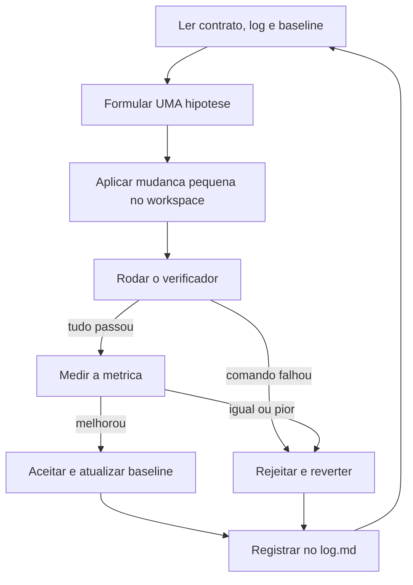

# Loop Engineering — agente de melhoria contínua

Este diretório guarda o "cérebro" de um agente que melhora um sistema em ciclos:
ele lê o contrato, propõe UMA mudança pequena, testa, mede o resultado e decide
manter ou reverter — registrando tudo no log.

O padrão: o agente lê o objetivo, propõe a mudança, testa, mede, decide e
registra — sem que você precise intervir a cada passo.

## Mapa dos arquivos

| Arquivo / pasta | Quem escreve | Para que serve |
|---|---|---|
| `program.md` | você (humano) | Contrato: objetivo, regras, critérios de aceite/rejeição e limites. |
| `config_loop.json` | você (humano) | O mesmo contrato em formato de máquina: comandos, métrica e limites usados pelo verificador. |
| `system_prompt.md` | você / IA | Como o agente deve se comportar (identidade, passos, segurança). |
| `log.md` | o agente | Histórico de cada iteração: hipótese, resultado e decisão. |
| `baseline.json` | o verificador | Os números do jogo: valor inicial, melhor valor, meta e progresso. |
| `workspace/` | o agente | Único lugar onde o agente pode mexer no código. |
| `outputs/` | o verificador | Relatórios e saídas de cada iteração. |
| `verificar_iteracao.py` | ferramenta | Roda os testes, mede a métrica, compara e sugere a decisão. |

## Fluxo de uma iteração



## Regra de ouro dos arquivos

- `program.md` e `config_loop.json` dizem **o que** pode ser feito (só o humano altera).
- O agente **não edita** `program.md`, `config_loop.json` nem `system_prompt.md`.
- Toda mudança de código acontece **somente** dentro de `workspace/`.
- Sem emojis nos arquivos e nas saídas deste diretório (compatibilidade com o console do Windows).

## Como usar — modo 1: com o agente do chat (recomendado para começar)

1. Coloque o projeto alvo em `workspace/` e ajuste `program.md` + `config_loop.json`.
2. Grave a linha de base: `python meu-loop-agente/verificar_iteracao.py medir --definir-baseline`
3. No chat, peça: "Leia `meu-loop-agente/system_prompt.md` e `meu-loop-agente/program.md` e execute uma iteração."
4. O agente aplica a mudança e roda o verificador. Para registrar a decisão:
   `python meu-loop-agente/verificar_iteracao.py registrar --decisao ACEITO --hipotese "texto"`

## Como usar — modo 2: verificação manual

```powershell
python meu-loop-agente/verificar_iteracao.py estado                 # mostra a situação atual
python meu-loop-agente/verificar_iteracao.py medir                  # mede a métrica agora
python meu-loop-agente/verificar_iteracao.py verificar --hipotese "troquei X por Y"
python meu-loop-agente/verificar_iteracao.py registrar --decisao REJEITADO --hipotese "troquei X por Y"
```

O comando `verificar`:

- roda todos os comandos de verificação (lint, tipos, testes, build...);
- mede a métrica principal;
- compara com o melhor valor de `baseline.json`;
- sugere a decisão (**ACEITO** se tudo passou e a métrica melhorou; **REJEITADO** caso contrário);
- grava um relatório completo em `outputs/iteracao_000001/relatorio.json`.

Códigos de saída do `verificar`: `0` = candidato a ACEITO · `2` = candidato a REJEITADO · `1` = erro de configuração.

## Como adaptar para outro tipo de projeto

O exemplo pronto é de um projeto Next.js (bundle inicial). Para outros alvos, troque só o `config_loop.json`:

| Campo | O que é | Exemplo Python |
|---|---|---|
| `verificacao.comandos` | comandos que precisam passar | `"python -m pytest -q"`, `"python -m ruff check ."` |
| `metrica.comando` | comando que imprime o número a medir | `"python scripts/medir_tempo.py"` |
| `metrica.regex` | como extrair o número da saída (1 grupo) | `"tempo medio: ([0-9.,]+) ms"` |
| `metrica.direcao` | `menor_melhor` ou `maior_melhor` | `menor_melhor` |

E atualize `program.md` (objetivo e arquivos permitidos) e `baseline.json` (`meta_percentual`).

## Segurança (regras que o agente segue)

- **Uma hipótese por iteração**, com diff pequeno (menos de 50 linhas).
- **Commit antes de cada iteração**: se a mudança for rejeitada, reverter é um comando só
  (ex.: `git checkout -- .` no repositório que contém o `workspace/`).
- **Nunca** tocar em arquivos proibidos (ver `program.md`), `.env`, segredos ou credenciais.
- **Parar** depois de 3 falhas seguidas de verificação e reportar.
- Limites de parada: meta atingida, 20 iterações ou 5 rejeições seguidas.

## Próximo passo (ainda não implementado)

Modo autônomo: um script que chama a API do DeepSeek (modelo e temperatura ficam em
`config_loop.json` -> `agente`) e roda o ciclo sem o chat. Vai precisar da chave
`DEEPSEEK_API_KEY` no `.env` (já existe o campo comentado em `.env.example`).
